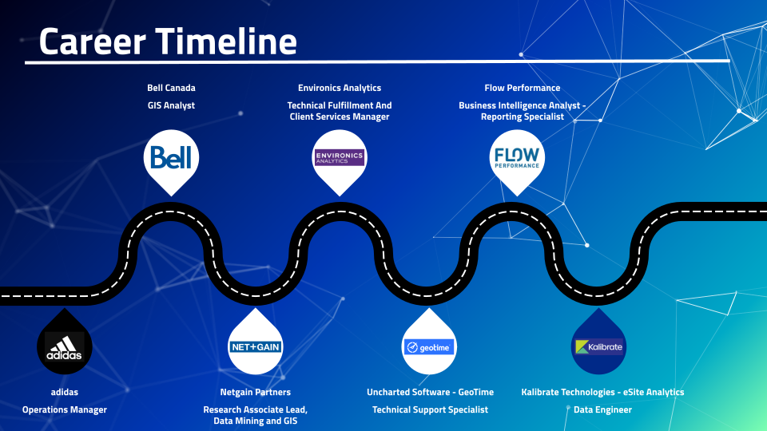

<div align="center">
<hr /><hr />
</div>

<div align="center">

<h1>Hi! Welcome to my GitHub Page!</h1>

</div>

<hr />

My name is Mauricio and welcome to my Github Page. The purpose of this space is to introduce myself and highlight current/past projects.

<hr />

Work History...

<hr />

Currently working with...

 - :desktop_computer: :date:	:file_cabinet:	MS SQL for database management: sales, customer transactions, location data and market segmentation
 - :chart_with_upwards_trend: :round_pushpin:	:family_man_woman_girl_boy: Power BI for data visualization: sales, customer transactions, and location data
 - :panda_face:	:star2:	:mag:	Python and libraries for data cleaning and manipulation
 - :world_map: :dart: :houses: Leaflet, ArcMap Pro, Google Earth, and Kepler for mapping
 - :globe_with_meridians: :earth_americas: :nazar_amulet:  ESRI ArcMap Pro for Geospatial Analysis and Data Science: Data Engineering, Visualization, Prediction, Object Detection, Pattern Detection over Space and Time, and Site Suitability

Currently working on...

- How-to-guides for Python libraries: Pandas, GeoPandas, PySpark, and ArcPy
- How-to-guides for ETL and data engineering tasks: Data wrangling, data cleaning, batching, and related data prep
- Continued Learning and Certification: MS Data Analyst, IIBA Data Analyst, IIBA BI Analyst, ESRI Academy, LinkedIn Learning, Alteryx and other online-resources
- Collecting and revisting past projects using updated data and software tools
- Winnie's Hotel and Theo's Restaurant

Interesting...
- FRED: https://fred.stlouisfed.org/
- ALPHA VANTAGE: https://www.alphavantage.co/
- Ventusky: https://www.ventusky.com/?p=40.6;-85.2;4&l=rain-3h
- Flight Tracking: https://www.flightaware.com/live/
- 30 Day Map Challenge: https://30daymapchallenge.com/
- geojson.io: https://geojson.io/#map=2/0/20
- mapsharper: https://mapshaper.org/
- Urban Institute: https://upward-mobility.urban.org/
- Geocoder: https://geocoder.ca/
- Nominatim: https://nominatim.org/release-docs/develop/
- AI: https://pair.withgoogle.com/explorables/
- Overture Maps: https://overturemaps.org/
- Leaflet: https://leafletjs.com/
- Folium: https://python-visualization.github.io/folium/latest/
- Mock up: https://www.mokkup.ai/
- Open Route Service API: https://openrouteservice.org/
- TomTom API: https://developer.tomtom.com/


<div align="center">
    
<div style="margin-left: auto;
            margin-right: auto;
            width: 30%">

|  |  |  |  |
|:-----|:-----|:-----|:-----|
| `::location::` |  Toronto, Ontario. CAN. | `::latitude,longitude::` |  [43.64722981, -79.39248166](https://www.google.com/maps/place/Toronto,+ON/@43.6581001,-79.3839192,8874m/data=!3m1!1e3!4m6!3m5!1s0x89d4cb90d7c63ba5:0x323555502ab4c477!8m2!3d43.653226!4d-79.3831843!16zL20vMGg3aDY?entry=ttu&g_ep=EgoyMDI0MDkyMy4wIKXMDSoASAFQAw%3D%3D/) |
| `::what3words::` |  [what3words.com](https://what3words.com/losses.times.crystals) | `::timezone::`|  ET/EST |
| `::bike_lanes::`|   [Bike Lanes Across Canada](https://vasquezme.github.io/canada-bike-lanes/) | `::interests::` |         </div> |
| `::to_poi::`|  [Toronto's Main Attractions](https://vasquezme.github.io/leaflet-map/) | `::es_poi::` |  [El Salvador's Volcanos](https://vasquezme.github.io/leaflet-map-es/) |
| `::linkedin::`|  www.linkedin.com/in/mevasquez | `::email::`|  m.e.vasquez8@gmail.com
| `::library::`|  www.torontopubliclibrary.ca/ | `::github::`|  https://github.com/vasquezme |

</div>
</div>

<hr />
<hr />

<body>
    <h1>Professional Bio:</h1>

</body>

<p>
  Solution-driven analytical professional with experience managing socioeconomic, geospatial, and transactional databases for software companies in the Marketing, Advertising, Law Enforcement, and Retail industries. Pursuing an opportunity to use skills in database management, data operations, data analysis and business analysis.

- Data and tech enthusiast in the areas of database management, data analysis, geospatial technologies, business intelligence and business systems

- Developed ETL pipelines streamlining data operations using database management, BI and visualization tools

- Related experience: Data warehousing, data lakes, data governance, stakeholder support, pre-sales support, sales enablement, product management, client advocacy, client services, community forums

<hr />

 &nbsp;&nbsp;&nbsp;&nbsp;&nbsp;&nbsp;  &nbsp;&nbsp;&nbsp;&nbsp;&nbsp;&nbsp;  

**Kalibrate Technology and eSite Analytics** &nbsp;&nbsp;&nbsp;&nbsp;&nbsp;&nbsp; *Data Engineer* &nbsp;&nbsp;&nbsp;&nbsp;&nbsp;&nbsp; 2022 - 2023

Responsibilities: 
 - Requirements gathering
 - Data migration into SaaS BI platforms
 - Process documentation

Tools used include: Alteryx | MS SQL | Power BI | Excel | Trailblazer | Kalibrate Location Intelligence | Inkscape | JIRA | Confluence

Website: [Kalibrate](https://kalibrate.com/) 

Take a look at some [examples...](https://github.com/vasquezme/winnie-hotel-theo-resto/tree/main) 

<hr />

**Williams Engineering and Flow Consulting** &nbsp;&nbsp;&nbsp;&nbsp;&nbsp;&nbsp; *Business Intelligence Analyst Reporting Specialist* &nbsp;&nbsp;&nbsp;&nbsp;&nbsp;&nbsp; 2021 - 2022

Responsibilities: 
- Client support

Tools used include: MS Power Apps | Power BI | 

<hr />

 &nbsp;&nbsp;&nbsp;&nbsp;&nbsp;&nbsp;  &nbsp;&nbsp;&nbsp;&nbsp;&nbsp;&nbsp;  

**Uncharted Software and GeoTime** &nbsp;&nbsp;&nbsp;&nbsp;&nbsp;&nbsp; *Technical Support Specialist* &nbsp;&nbsp;&nbsp;&nbsp;&nbsp;&nbsp; 2019 - 2021

Responsibilities: 
 - Requirements gathering
 - Data migration into SaaS cell phone forensics mapping and analytics platform
 - Software pre-sales demo.
 - License fulfillment
 - Technical support and installation support
 - Training and monthly demo.
 - Client activity support and tracking
 - SaaS and desktop UAT and bug reporting

Tools used include: Excel | GeoTime | TellFinder | ArcMap | Freshdesk | Salesforce | WordPress | JIRA | Camtasia

Website: [GeoTime](https://www.geotime.com/) 

<hr />


**Environics Analytics** &nbsp;&nbsp;&nbsp;&nbsp;&nbsp;&nbsp; *Technical Fulfillment and Client Services Manager* &nbsp;&nbsp;&nbsp;&nbsp;&nbsp;&nbsp; 2012 - 2019

Responsibilities:
 - Data production
     - Data products cleaning and standardization
     - ETL processing for data lakes and client distribution
 - Product management support
     - Pre-release and release product documentation
     - Product bundling
     - SaaS platform UAT testing and bug reporting
 - Client services
     - Zendesk implementation with macros and triggers
     - Client support through phone, email and ticketing systems
     - Data walkthroughs
     - SaaS platform training
     - Customer and trade area segmentation analysis
     - Geodemographics and location analysis training
 - IT
     - SFTP management and user accessibility
     - Process documentation for data governance
 - Fulfillment
     - SaaS platform license distribution
     - Data product distribution
 - Sales Enablement
     - Account managment and business rules
     - SaaS licences and data product analytics
 - Client Advocacy
     - Requirements gathering
     - Pre-sales demos., SaaS platform demos., and data support
     - Customer segmentation and market insights

Tools used include: Alteryx | Excel | ENVISION5 | Zendesk | MS Dynamics | Globalscape |

Website: [Environics Analytics](https://environicsanalytics.com/en-ca) 

<hr />

**NetGain Partners**  &nbsp;&nbsp;&nbsp;&nbsp;&nbsp;&nbsp; *Research Associate, Data Mining and GIS*  &nbsp;&nbsp;&nbsp;&nbsp;&nbsp;&nbsp; 2011 - 2012

Responsibilities:
- Survey design and administration
- Data analysis
- Report writing

Tools used include: MS Project | Excel | SurveyMonkey | ArcMap

<hr />

**Bell Canada Inc.**   &nbsp;&nbsp;&nbsp;&nbsp;&nbsp;&nbsp; *Geospatial Analyst* &nbsp;&nbsp;&nbsp;&nbsp;&nbsp;&nbsp; 2011 - 2011

Resonsibilities:
- Location analysis for retail and competitors
- Market research

</p>

<hr />
<hr />

<body>
    <h1>Education:</h1>

</body>

<p>
    <div align="center"> 

  <div align="left">  Bachelor of Arts, Geographic Analysis - Toronto Metropolitan University, 2011

</p>

 <h2>Courses and Related Training</h2>

<br>

- Spatial Data Science: The New Frontier in Analytics - ESRI,  Fall 2024
- Data Analyst - International Institute of Business Analysis (IIBA), Fall 2024
- Business Intelligence Specialist - International Institute of Business Analysis (IIBA), Fall 2024

<br>

|  |  | 
|:-----|:-----|
| Level Up: Advanced SQL | Database Foundations: Database Management and Administration
| ETL In Python and SQL | Tableau 2024.1: Essential Training
| Intermediate SQL: Data Reporting and Analysis | Power BI Essential Training
| Microsoft SQL Server Essential Training 2022/2019 | Data Literacy: Exploring and Describing Data
| Relational Databases Essential Training | Marketing Analytics Setting and Measuring KPIs


<br>

<hr />
<hr />

<body>
    <h1>Projects and Related Experience</h1>

</body>

<p>

<details>
 
<summary><b>Data Engineer</b></summary>
<br>

  - ETL pipelines from a variety of sources in to SaaS BI platform
  - Database management for sales, transactions and customer records
  - Tools used include: Alteryx, SQL, Power BI, TrailBlazer, and Kalibrate Location Intelligence

Database Diagram for Winnie's Hotel and Theo's Resto


Winnie's Hotel and Theo's Resto Locations with 3 KM Buffer in ArcGIS Pro


Winnie's Hotel and Theo's Resto Locations - Power BI Dashboard


</details>

<details>

<summary><b>Reporting Analyst</b></summary>
<br>

  - Created workflow to present Power BI reports
  - Implemented process to capture change requests inpacts on resources and project deliverables
  - Tools Used Include: MS Power Apps, Form, Excel, Power BI

</details>

<details>

<summary><b>Technical Support</b></summary>
<br>

  - Software technical support and product advocate
  - Pre-sales product demos., software training, product webinars, product fulfillment, community forums and sales enablement
  - Tools used include: MS Office, Freshdesk, Zendesk, MS Dynamics and Salesforce

</details>

<details>

<summary><b>Product Licensing, Fulfillment and Support</b></summary>
<br>

  - Batch Scripting for Data Warehousing
      - Creating file managment process to create data management system
      - CMD line Batch Scripting using XCOPY, MD, MOVE, DEL, REN, TREE and others to manage files and directories across business systems.
      - CMD line used to call on WINZIP, zip and rename files for distribution

</details>

<details>

<summary><b>Product Mangement</b></summary>
<br>

  - Data production and product bundling for distribtion 
  - Data QA
  - SaaS End-User feature and workflow testing

</details>

<details>

<summary><b>Client Services</b></summary>
<br>

  - Client advocacy 
  - CRM reporting
  - Zendesk, Freshdesk and JIRA

</details>

<details>

<summary><b>Elections Ontario - 2022 General Elections</b></summary>
<br>

  - Polling stations 
  - Voter response rates

Elections Ontario - 2022 General Election ArcMap Pro


</details>

<details>

<summary><b>Toronto Environmental Alliance - PM2.5 in the City of Toronto</b></summary>
<br>

  - Harmful toxins reported to City of Toronto


</details>

<details>

<summary><b>City of Toronto Arts Incubator Program</b></summary>
<br>

  - Industry research and focus groups
  - Report writing

</details>

<details>

<summary><b>Artscape</b></summary>
<br>

  - Industry research and survey distribution
  - Data analysis
  - Report writing


</details>

<details>

<summary><b>Centennial College Field Feasibility Study</b></summary>
<br>

  - Business plan for building multipurpose sports field
  - Market research

Business Plan Outline


Business Plan Schedule


</details>

<details>

<summary><b>Deforestation in Rodonia, Brazil</b></summary>
<br>

  - Remote sensing and image analysis for pattern detection
  - Change over time analysis

</details>

</details>

<br>

</p>

<hr />
<hr />

<body>
    <h1>Technical Skills and Tools used:</h1>

</body>


|  |  |  |  |  |  |
| ------------- | ------------- | ------------- | ------------- | ------------- | ------------- |
|   |  |  |  |  |   
|  |   |  |  |  | 

Source logos: https://simpleicons.org/

<br>

<hr />
<hr />


<!--

<body>
    <summary><h1>Relevant Experience and Projects:</h1></summary>

</body>


Database Diagram for Winnie's Hotel and Theo's Resto


Winnie's Hotel and Theo's Resto Locations with 3 KM Buffer in ArcGIS Pro


Winnie's Hotel and Theo's Resto Locations - Power BI Dashboard


</details>

### Reporting Analyst

<details>

<summary>Reporting Analyst</summary>

  - Created workflow to present Power BI reports
  - Implemented process to capture change requests inpacts on resources and project deliverables
  - Tools Used Include: MS Power Apps, Form, Excel, Power BI

You can add an image or a code block, too.

</details>


<details>

<summary>Technical Support</summary>

  - Software technical support and product advocate
  - Pre-sales product demos., software training, product webinars, product fulfillment, community forums and sales enablement
  - Tools used include: MS Office, Freshdesk, Zendesk, MS Dynamics and Salesforce

You can add an image or a code block, too.

```ruby
   Links/Resources
```

</details>

### Product Licensing, Fulfillment and Support

<details>

<summary>Product Licensing, Fulfillment and Support</summary>

  - Highlight1
  - Batch Scripting for Data Warehousing
      - Creating file managment process to create data management system
      - CMD line Batch Scripting using XCOPY, MD, MOVE, DEL, REN, TREE and others to manage files and directories across business systems.
      - CMD line used to call on WINZIP, zip and rename files for distribution


</details>

### Product Mangement

<details>

<summary>Product Mangement</summary>

  - Data production and product bundling for distribtion 
  - Data QA
  - SaaS End-User feature and workflow testing

You can add an image or a code block, too.

</details>


<details>

<summary>Client Services</summary>

  - Client advocacy 
  - CRM reporting
  - Zendesk, Freshdesk and JIRA


You can add an image or a code block, too.

</details>


<br>


<!--

<p>

|  Kalibrate Technologies - eSite Analytics |  DATA ENGINEER | Remote |
| ------------- | ------------- | ------------- |

<p>
<p>

|  Williams Engineering Canada - Flow Consulting |  BUSINESS INTELLIGENCE ANALYST - REPORTING SPECIALIST | Toronto, Hybrid |
| ------------- | ------------- | ------------- |

<p>

Environics Analytics


## **Tools, Resources and Coding**
<hr />
<br>

| Tools etc.|  |  |  |
| --- | --- | --- | --- | 
| Alteryx | GIS |  |  
|  | |  | 
| |  |  |  
|  |  | |  | 
 |  |  |  |


<br>

Resources:
<hr />


<br>

<hr />

| Coding etc.|  |  |  |
| --- | --- | --- | --- |
| T-SQL |  |  | | 
 |  |  |  |  | 

<br>

<hr />

| Fun| Links |
| --- | --- |
| T-SQL | [Awesome Maps](https://github.com/simsieg/awesome-maps) |

<br>

## Links
<hr />

- Markdown
- MarkdownGuide
- Chartmaker Directory
- GeeksforGeeks
- Spark Apache
- Github How to Get Started
- Gethub Public API
- Marketing APIs [Marketing API](https://blog.hubspot.com/website/free-open-apis?hubs_content=blog.hubspot.com%2Fwebsite%2Fapi-calls&hubs_content-cta=free%20and%20open%20API)
- https://github.com/RandomFractals/geo-data-viewer#configuration
- https://www.imperva.com/learn/data-security/data-lineage/#:~:text=Data%20Lineage%20for%20Data%20Processing%2C%20Ingestion%2C%20and%20Querying,-When%20building%20a&text=You%20need%20to%20keep%20track%20of%20tables%2C%20views%2C%20columns%2C,be%20used%20for%20lineage%20analysis
- (https://docs.kepler.gl/) | (https://docs.kepler.gl/)
- (https://www.thestar.com/entertainment/visual-arts/an-inside-look-at-the-escalating-crisis-in-toronto-arts-we-have-to-come-together/article_a328aaf8-f5aa-11ee-aad3-33ecca95b947.html?utm_medium=social&utm_source=email&utm_campaign=user-share)
- (https://blog.hubspot.com/website/free-open-apis?hubs_content=blog.hubspot.com%2Fwebsite%2Fapi-calls&hubs_content-cta=free%20and%20open%20API)
- (https://www.keybr.com/)
- (https://www.tutorialspoint.com/index.htm)
- https://handsondataviz.org/

<br>
-->
<!--
## **Mapping4Fun**

**vasquezme/vasquezme** is a ✨ _special_ ✨ repository because its `README.md` (this file) appears on your GitHub profile.

Here are some ideas to get you started:

- 🔭 I’m currently working on ...
- 🌱 I’m currently learning ...
- 👯 I’m looking to collaborate on ...
- 🤔 I’m looking for help with ...
- 💬 Ask me about ...
- 📫 How to reach me: ...
- 😄 Pronouns: ...
- ⚡ Fun fact: ...
-->
